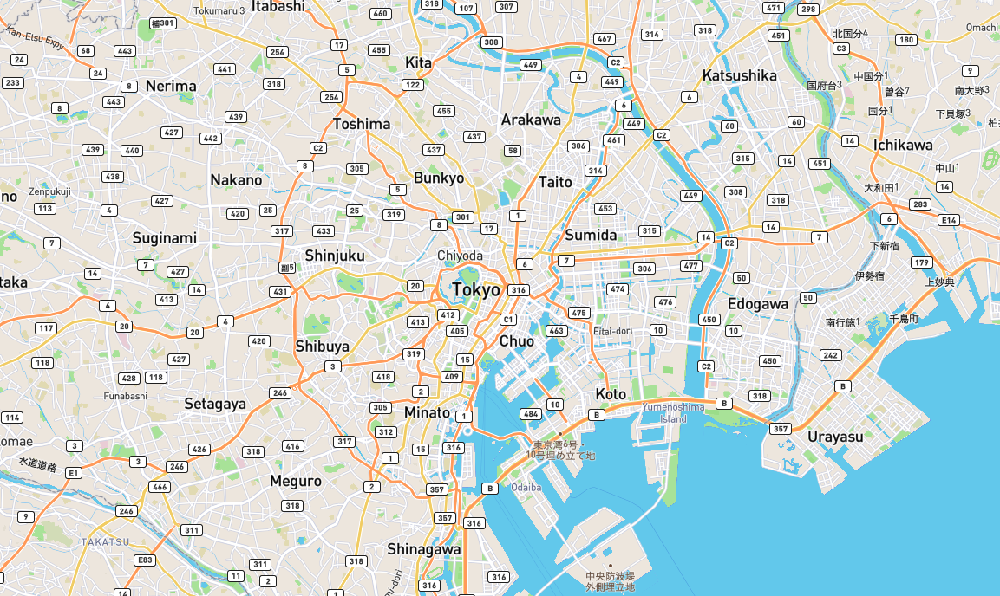

# mapbox-typescript-webpack-starterkit
Super easy [Mapbox-GL-JS](https://docs.mapbox.com/mapbox-gl-js/api/) Starterkit in TypeScript + Webpack enviroment.

# Usage 
## First get your AccessToken for mapbox
Please check 👇 docs. 
- [Access tokens | How Mapbox works | Help | Mapbox](https://docs.mapbox.com/help/how-mapbox-works/access-tokens/)

## Set AccessToken 
```ts
// src/const.ts
export namespace MapConst {
	export const ACCESS_TOKEN = 'here!!'
	...
}
```

## Let's build and Go!
```bash 
$ yarn install 
$ yarn start:dev
```




## Links
- [dayjournal/mapboxgljs-starter: Start Mapbox GL JS easily. [Mapbox GL JS, webpack]](https://github.com/dayjournal/mapboxgljs-starter)